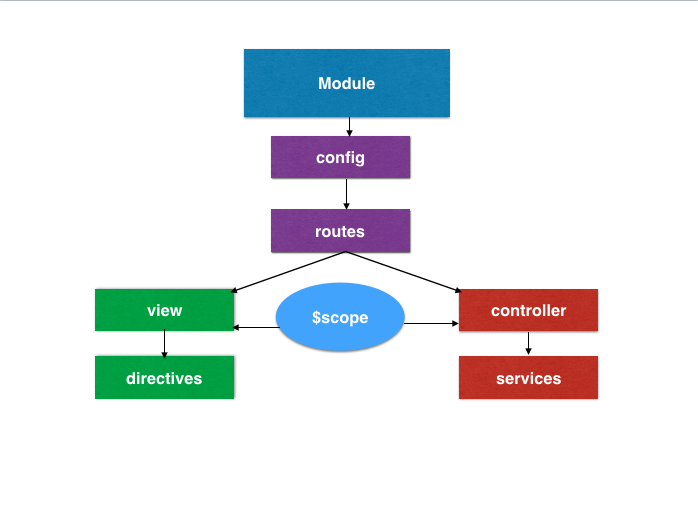

#### NOTES on routing

Hash routing is based on anchor tag hashes which allow you to scroll to different parts of a page (https://en.wikipedia.org/wiki/Fragment_identifier).  http://localhost:3003 becomes
http://localhost:3003/#/ when using standard angular router.  You can add routes with a route config and include route parameters like http://localhost:3003/#/edit/12345.

You need to install angular-route and require the extra file to use ngRoute.

###### goal is to map a path to html and controller

* $route: service depends on $location and $routeParams
* $location: get and set path
* $routeParams: get and set route params
* $routeProvider: use to configure routing, for example:
``` JavaScript
crudApp.config(['$routeProvider', function($route) {
  $route
    .when('/', {
      templateUrl: '/templates/partials/FirstApp.html'
    })
    .when('/list', {
      templateUrl: '/templates/partials/ListView.html',
      controller: 'ListController'
    })
```
* $routeProvider 'resolve' can inject key value pairs into controller


###### ngView
When you use <ng-view> directive in your html it will be replaced by partial html specified in route config based on path.


